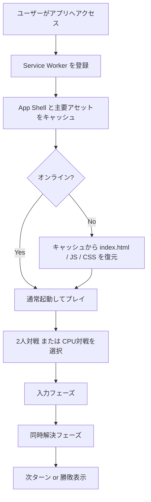

# 機能一覧

## 昨日の説明（引き継ぎ）

- 同時手番の入力を 1 ターン分まとめて解決するボム対戦ゲーム。
- 2人対戦と CPU 対戦を切り替え可能。
- 爆発、連鎖、Kick、アイテム取得、盤面縮小、勝敗判定までを 1 ターン解決で処理。

## 現在の機能

1. コアゲームロジック（純粋関数 `reduce`）
2. PixiJS 盤面描画 UI
3. 対戦モード切替（2人/CPU）
4. PWA インストール対応
5. Service Worker によるオフライン起動

## フロー図（PWA起動〜プレイ）

